# Principes d'orchestration des événements (billariz corp)

---

Component `EventMonitor`


---


## 🧭 Introduction


Le composant `EventMonitor` joue un rôle **central et invisible** dans l’orchestration des processus métiers automatisés de la plateforme Billariz. C’est un **moteur planifié** qui fonctionne en tâche de fond pour détecter, filtrer et lancer des événements à exécuter, tout en assurant un suivi rigoureux des actions entreprises.


Il intervient notamment dans les cycles de facturation, relance, activation de services ou envoi de notifications.


---


## 🎯 Objectif global


- Identifier automatiquement les événements planifiés à exécuter

- Vérifier qu’ils remplissent toutes les conditions fonctionnelles de déclenchement

- Les transmettre à une file d’exécution (queue) en toute sécurité

- Journaliser leur traitement pour audit et supervision


---


## 🔁 Rappel du cycle d’exécution


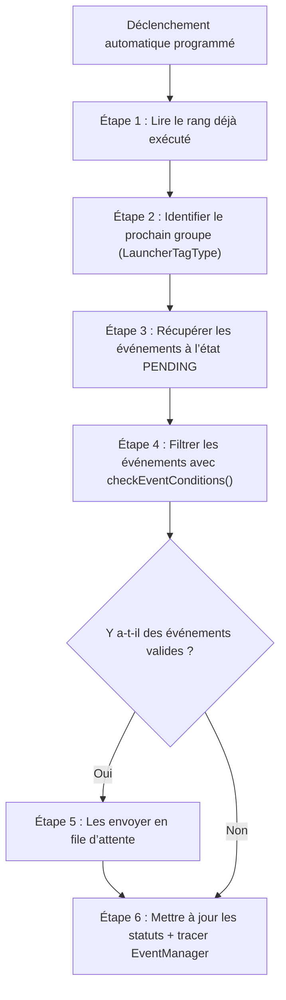


---


## 🧩 Pourquoi chaque étape est importante


### 1. 🔍 Récupération du rang exécuté (`EventManagerRepository`)


> Le système suit l’ordre logique d’exécution des groupes d’événements (appelés `LauncherTagType`). Chaque groupe est associé à un rang (`rank`). Cette étape permet de **reprendre l'exécution là où elle s'était arrêtée**, sans sauter ni répéter.


---


### 2. 🎯 Sélection du prochain `LauncherTagType`


> On ne traite qu’un groupe d’événements à la fois, selon leur ordre logique. Cela permet de séquencer précisément les traitements métiers sensibles (ex : d’abord générer les factures, puis envoyer les relances).


---


### 3. 📋 Récupération des événements à exécuter


Critères :

- Statut = `PENDING`

- Mode d’exécution = `EVENT_MANAGER`

- Appartient au `LauncherTagType` en cours

- `triggerDate` atteinte

- Récurrence respectée (`checkEventExecutionDate`)


**Pourquoi ?**

→ Pour ne pas traiter des événements prématurément ou en double.


---


### 4. ✅ `checkEventConditions(event)`


Cette méthode agit comme un **filtre fonctionnel** :


```java

return (

event.getTriggerDate() != null &&

checkEventTriggerDate(event.getTriggerDate()) &&

checkEventExecutionDate(event)

);

```


#### Pourquoi ces conditions ?


- `triggerDate` assure que l'événement est "programmé".

- `checkEventTriggerDate` garantit qu’il est "mature".

- `checkEventExecutionDate` évite un déclenchement prématuré (si l’événement est récurrent).


🧠 Exemple :

> Un événement avec `triggerDate = 2025-05-01` et `recurrence = 3 jours` ne sera relancé que le **04 mai minimum**, même si son statut est toujours `PENDING`.


---


### 5. 🚀 Envoi des événements en file


- Les événements valides sont groupés en lots (`packetSize`) et envoyés dans la file d’exécution via `queueProducer`.

- Ils sont immédiatement passés en statut `IN_PROGRESS` pour éviter tout double traitement.


📌 Si un événement est de rang 1 dans sa séquence, l’`Activity` liée passe également à `IN_PROGRESS`.


---


### 6. 🧾 Journalisation (`EventManager`)


> Chaque exécution de groupe (`LauncherTagType`) est tracée avec un horodatage dans `EventManager`. Cela permet :

- Un audit des traitements

- Une supervision des enchaînements

- Une protection contre les relances accidentelles


---


## 🧱 Modèle de Données Fonctionnel


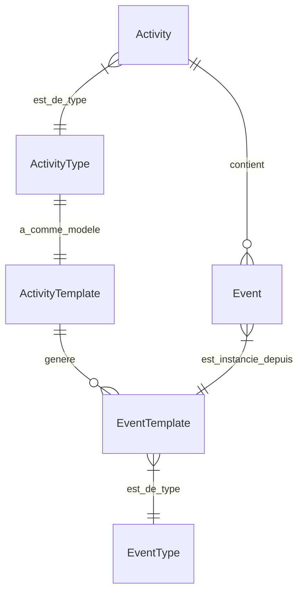


### 1. `Activity`


Instance d’un processus métier (ex : facturation client, relance). Contient plusieurs `Event`.


### 2. `ActivityType`


Type d’activité métier. Permet de catégoriser les activités pour les filtrer, organiser ou prioriser.


### 3. `ActivityTemplate`


Modèle de conception d’une `Activity`. Il contient les étapes (événements) à enchaîner dans un ordre (`rank`) donné.


### 4. `EventTemplate`


Définit un événement standardisé à insérer dans une activité, avec son rang, mode, type, et conditions.


### 5. `EventType`


Type de traitement attendu. Exemples :

- `SEND_EMAIL`

- `GENERATE_PDF`

- `UPDATE_LEDGER`


---


## 💡 Cas métier illustratif


> **Contexte** : Un client souscrit à un service électricité.

Le back-office déclenche une `Activity` de type `FACTURATION_MENSUELLE`.


### Ce que configure le `ActivityTemplate` :


| Rang | EventType | Mode d’exécution | Description |
|------|-----------|------------------|-------------|
| 1    | `GENERATE_PDF` | `EVENT_MANAGER` | Générer la facture |
| 2    | `ARCHIVE_PDF`  | `EVENT_MANAGER` | L’archiver |
| 3    | `SEND_EMAIL`   | `EVENT_MANAGER` | L’envoyer au client |


🧠 Chaque événement a :

- Une `triggerDate` propre

- Une récurrence (ex : 30 jours)

- Un statut suivi individuellement


`EventMonitor` exécute chaque événement dans l’ordre et assure la traçabilité.


---


## 📘 Glossaire


| Terme | Définition |
|-------|------------|
| **Event** | Action métier déclenchable automatiquement |
| **EventTemplate** | Modèle d’événement réutilisable dans plusieurs activités |
| **EventType** | Catégorie d’événement (comportement) |
| **Activity** | Ensemble d’événements liés à une action métier globale |
| **ActivityTemplate** | Modèle d’orchestration d’activité |
| **LauncherTagType** | Groupe d’ordonnancement utilisé par EventMonitor |
| **EventManager** | Table de suivi des exécutions automatiques |

---


## 🙋 FAQ Fonctionnelle


**Que se passe-t-il si aucun événement n’est trouvé ?**

→ Rien n’est lancé, mais une trace peut être insérée dans `EventManager`.


**Un événement peut-il être ignoré ?**

→ Oui, s’il ne respecte pas sa condition de récurrence ou si son `triggerDate` est dans le futur.


**Et s’il échoue ?**

→ Son statut restera bloqué, et des outils de relance manuelle ou redémarrage du flux peuvent être utilisés.


**Peut-on combiner `MANUAL` et `EVENT_MANAGER` ?**

→ Oui, une activité peut contenir des événements de modes différents, certains exécutés automatiquement, d’autres manuellement.


---


## ✅ Synthèse


`EventMonitor` est le **chef d’orchestre silencieux** de Billariz, qui permet à vos activités de vivre dans le temps, de façon automatisée, fiable, traçable, et conditionnelle.

Il repose sur une architecture modulaire, déclarative et pilotée par les données.


---


# Fonctions d’extension (Tags)


Le moteur d’automatisation **Billariz** repose sur une architecture modulaire et extensible.

Au cœur de cette extensibilité se trouvent les **fonctions d’extension**, appelées **tags**, qui encapsulent des logiques métier unitaires, orchestrées dans le cadre d’une **activité événementielle**.


Chaque tag représente un **traitement autonome, transactionnel, et réutilisable**, déclenché dans le cadre d’un événement métier.

Ils permettent de **composer des chaînes de traitements pilotées par configuration**, et constituent l’épine dorsale du moteur de traitement.


---

## 🎯 Objectifs des tags


- Exécuter des traitements métier précis et isolés (valorisation, facturation, clôture, etc.)

- Être chaînés dynamiquement dans des workflows événementiels

- Être configurables par type d’activité (`ActivityType`) et action

- Garantir des traitements traçables, testables et réversibles


---


## ⚙️ Caractéristiques clés


- **Stateless** et **idempotents**

- Gérés via l’interface standard `Launcher`

- Exécutés dans des contextes transactionnels indépendants (`REQUIRES_NEW`)

- Peuvent modifier l’état d’objets métier (contrats, relevés, TOS, factures…)

- Produisent :

- des journaux d’exécution (`Journal`)

- des messages structurés (`messageCode`)

- Peuvent déclencher d’autres activités via `launcherQueue`


---


## 📦 Catégories de tags


| Catégorie | Exemples de tags |
|-----------|------------------|
| **Émission** | `BillingCompute`, `BillingPrintShop`, `BillingValidation` |
| **Cycle de vie** | `UpdateContractStatus`, `TermOfServiceTermination`, `UpdateMeterReadStatus` |
| **Valorisation** | `BillingValuation`, `ComputeBillingCycle`, `UpdateBillableChargeStatus` |
| **Métier spécifique** | `TermOfServiceInstallation`, `ValidateBillableCharge` |


---


## 📚 Documentation des tags


Chaque tag dispose d’une fiche fonctionnelle dédiée, incluant :


- ✅ Objectif métier

- 🔁 Schéma de cycle d’exécution

- 🧠 Règles de gestion détaillées

- 💥 Liste des codes d’erreurs et conditions

- 📝 Journaux et `messageCode` générés


---


## 🔁 Exemple de séquence de tags


Lorsqu’un contrat arrive à échéance, la chaîne suivante peut être exécutée :


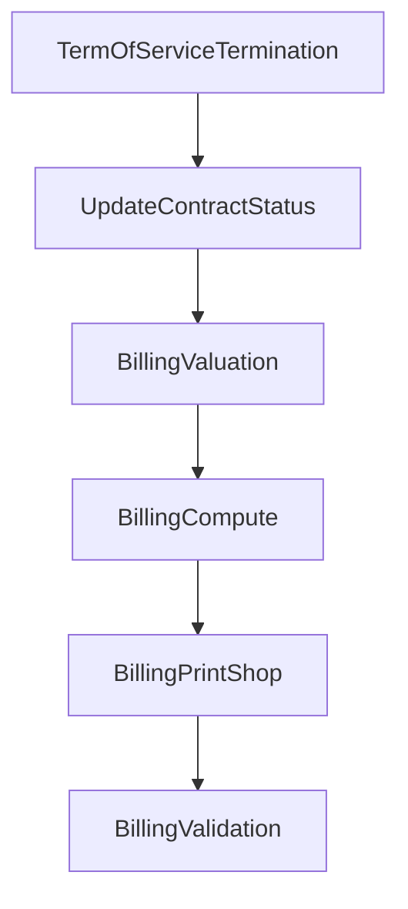


Chaque tag est exécuté dans son propre contexte transactionnel, avec suivi complet de l’état métier, journalisation et propagation des erreurs.


---


## 📦 Exemple d’implémentation de tag (simplifiée)


```java

public class UpdateContractStatus implements Launcher {
    public void process(Event event, EventExecutionMode mode) {
        Contract contract = contractRepository.findById(event.getActivityId())
                .orElseThrow();
        if (contract.getContractualEndDate().isBefore(LocalDate.now())) {
            contract.setStatus(ContractStatus.TERMINATED);
            contractRepository.save(contract);

            journalUtils.addJournal(
                ObjectType.CONTRACT,
                contract.getId(),
                "CONTRACT_TERMINATED",
                new Object[]{},
                event,
                JournalAction.LOG
            );
        }
    }
}

```


---


## 💡 Bonnes pratiques


- Un tag doit être **testable individuellement**

- Ne jamais encapsuler plusieurs logiques dans un même tag

- Privilégier une granularité fonctionnelle claire

- Garantir une **journalisation systématique** pour toute exécution


---


Les tags forment la **boîte à outils fonctionnelle de Billariz**.

Ils permettent une adaptation rapide des processus métier aux contextes spécifiques des clients, tout en maintenant la robustesse et la traçabilité du moteur d’exécution.


---


# Installation des termes de services

---

Tag `TermOfServiceInstallation`

---


## 🧭 Contexte général


Le tag `TermOfServiceInstallation` est un composant fondamental du moteur d’automatisation Billariz.

Il est responsable de l’installation complète des chaînes métier :


- `Service`

- `TermOfService` (TOS)

- `ServiceElement` (SE)


à partir d’un `Event` métier, en s’appuyant sur des **options de démarrage** configurées dynamiquement.


---


## 🎯 Objectifs fonctionnels


- Identifier le contrat concerné

- Identifier les services à installer ou à utiliser

- Appliquer dynamiquement des règles issues des `StartOption`

- Créer les TOS et SE associés

- Gérer les statuts des entités impliquées

- Garantir la cohérence des données : exclusivité, validité, complétude

- Traiter les cas d'erreur métier bloquants avec traçabilité


---


## 🔁 Cycle d’exécution général


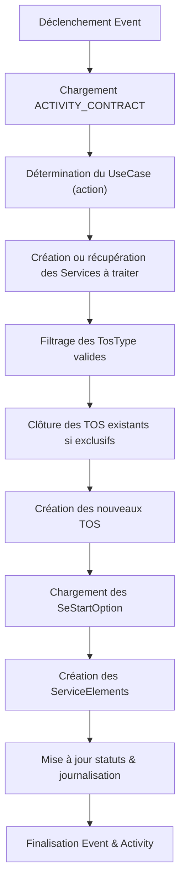

---


## ⚙️ Règles métier appliquées


### 🔹 Identification du contexte


- Le tag lit l’action portée par l’événement : `TosInstallationUseCase`

- Il en déduit un scénario parmi :

- `TOS_ONE_SELF`

- `DEFAULT_SERVICES`

- `SERVICE`


---


### 🔹 Création des services (`DEFAULT_SERVICES`)


- Les services sont créés automatiquement si :

- Ils sont définis comme `isDefaultService = true`

- Une `ServiceStartOption` valide est trouvée pour le contrat + client + POS

- Tous les filtres métier sont passés (market, customer type, etc.)


📌 Si aucun service par défaut ne correspond → blocage.


---


### 🔹 Sélection des TOS (`ServiceStartOption → TosType`)


- Chaque `Service` est analysé à partir de ses `ServiceStartOption`

- Un `TosType` est retenu si tous les critères sont remplis :

- Compatibilité contrat, client, POS

- Direction

- Statut initial du service

- Validité temporelle


---


### 🔹 Gestion des TOS exclusifs


- Si le `TosType` est `exclusive` :

- Tous les autres TOS de ce type, encore actifs pour ce contrat, sont recherchés

- Ils sont **clôturés automatiquement** par le tag `TermOfServiceTermination`

- Cela garantit qu’un seul TOS de ce type est actif à un instant T


---


### 🔹 Création des TOS


- Le TOS reçoit :

- Son type (`TosType`)

- Son statut (`PENDING_START`)

- Ses dates (début, fin via `TosStartOption`)

- Le `priceType`

- Les propriétés spécifiques (exclusive, master, touGroup…)


---


### 🔹 Création des SE (`ServiceElement`)


- La liste des SE est déterminée via `SeStartOption` du `TosType`

- Chaque `SE` est créé avec ses caractéristiques :

- Type, tarifs, seuils, facteurs, taux de TVA, catégories, etc.

- Le `priceType` du TOS influence la source des valeurs (TOS ou Service)


---


### 🔹 Mise à jour des statuts


- Le TOS passe en `PENDING_START`

- Le Service passe en `INSTALLED`

- Si une erreur intervient → `IN_FAILURE`


---


## 🧾 Liste des erreurs fonctionnelles


| Code | Signification | Déclencheur |
|------|---------------|-------------|
| `MISSING_CONTRACT` | Aucune relation `ACTIVITY_CONTRACT` trouvée | Event mal formé |
| `MISSING_CONTRACT_IN_DB` | Contrat introuvable en base | Relation cassée |
| `MISSSING_PAYER` | Aucun `Third` de type `ACTOR_PAYER` trouvé | Données contractuelles incomplètes |
| `MISSING_POS_CONF` | Aucune configuration POS valide trouvée | Contrat/POS invalide |
| `MISSING_SERVICES` | Aucun service valide trouvé à installer | Filtrage trop strict |
| `MISSING_SERVICES_EVENT` | Aucune relation `ACTIVITY_SERVICE` trouvée | Cas `SERVICE` mal préparé |
| `MISSING_DEFAULT_SERVICES` | Aucun service par défaut trouvé via `ServiceStartOption` | Configuration manquante |
| `MISSING_SERVICE_START_OPTION` | Aucun `ServiceStartOption` valide trouvé | Filtres métiers KO |
| `MISSING_TOS_TYPE` | `TosType` introuvable en base | Référence cassée |
| `MISSING_TOS_START_OPTION` | Aucune `TosStartOption` trouvée pour le type | Donnée métier manquante |
| `MISSING_SE_START_OPTION` | Aucun `SeStartOption` trouvé pour le `TosType` | Filtrage KO |
| `MISSING_SE_TYPE` | `SeType` introuvable en base | Incohérence de configuration |

---


## 📘 Glossaire


| Terme | Définition |
|-------|------------|
| `TosInstallationUseCase` | Détermine le scénario d’exécution |
| `ServiceStartOption` | Règle de sélection/filtrage des services |
| `TosStartOption` | Définit les conditions et dates de création des TOS |
| `SeStartOption` | Décrit les propriétés des SE à créer |
| `TOS` | Terme de service rattaché à un contrat et service |
| `POS` | Point de service client |
| `ContractPerimeter` | Périmètre contractuel lié au contrat |
| `Journal` | Traçabilité du traitement |
| `LauncherFatalException` | Exception bloquante, arrête l’exécution |

---


## ✅ Résumé


Le tag `TermOfServiceInstallation` est un **orchestrateur dynamique et intelligent** d’installation des chaînes `Service → TOS → SE`, en fonction :


- d’un événement déclencheur métier,

- de règles paramétrées et de filtres multiples,

- avec traçabilité et sécurité métier complète.


C’est un composant **stratégique pour le bon démarrage de toute relation contractuelle** dans Billariz.


---


# Mise à jour du statut du contrat

---

Tag `UpdateContractStatus`


---


## 🧭 Contexte général


Le tag `UpdateContractStatus` est un composant métier essentiel dans le moteur d'automatisation Billariz.

Il permet de **mettre à jour le statut d’un contrat** en fonction :

- des conditions métier observées (dates, services associés…),

- de règles prédéfinies (`ObjectProcessRule`),

- ou d’une **action explicite** portée par un `Event`.


Ce tag assure la **gestion du cycle de vie du contrat**, en cohérence avec l’activité déclenchée et la stratégie de pilotage métier.


---


## 🎯 Objectifs fonctionnels


- Identifier le contrat ciblé via la relation `ACTIVITY_CONTRACT`

- Déterminer le statut à appliquer, automatiquement ou via l’action reçue

- Chercher la règle de transition (`ObjectProcessRule`) correspondante

- Mettre à jour le contrat et son périmètre si nécessaire

- Créer de nouvelles `Activity` si défini par la règle

- Tracer les actions via `Journal`


---


## 🔁 Cycle d’exécution


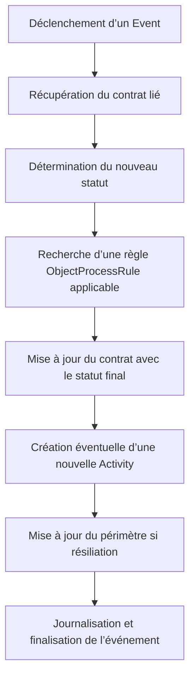


---


## ⚙️ Logique métier détaillée


### 1. 🔗 Chargement du contrat


- Le tag utilise la relation `ACTIVITY_CONTRACT` pour retrouver l’ID du contrat ciblé

- Si la relation ou le contrat sont absents : exception `MISSING_CONTRACT[_IN_DB]`


---


### 2. 🧠 Détermination du statut à appliquer


Trois sources possibles :


- ✅ Action explicite portée par l’`Event`

- ✅ Statut détecté automatiquement :

- `INSTALLED` → vérifie les conditions de démarrage (`checkStartingConditions`)

- `CONTRACTUAL_END_DATE` présent → vérifie les conditions d'arrêt (`checkStoppingConditions`)

- ✅ Si aucune logique ne permet de définir un statut → `"*"` (joker)


---


### 3. 📘 Application de la règle (`ObjectProcessRule`)


- Le système filtre les règles par : `objectType = CONTRACT`, statut courant, statut cible, catégorie client

- Si aucune règle ne correspond, et que le statut cible n’est pas `"*"` → `NO_RULE_FOUND`


---


### 4. 📝 Mise à jour et journalisation


- Le contrat reçoit le `finalStatus` de la règle

- Un journal est généré avec l’action `STATUS_UPDATE_BY_RULE`

- Code journal : `STATUS_CHANGE`


---


### 5. 🏁 Mise à jour du périmètre en cas de clôture


Si le contrat passe à `TERMINATED` ou `CANCELLED` :


- Le `ContractPerimeter` reçoit une date de fin = `contractualEndDate`

- Si périmètre `MONO_SITE`, on clôt aussi le périmètre associé

- Le statut passe à `CANCELLED` ou `CLOSED` selon le cas


---


### 6. ⚡ Création d’activités complémentaires


- Si la règle contient un `activityType`, le tag utilise `launcherQueue` pour créer une nouvelle `Activity`

- Lien `ObjectType.CONTRACT` + agent = `"systemAgent"`


---


## 📌 Méthodes clés


| Méthode | Rôle |
|--------|------|
| `checkStartingConditions` | Si services actifs → `EFFECTIVE` |
| `checkStoppingConditions` | Si contrat terminé ou tous services clôturés → `CANCELLED` ou `TERMINATED` |
| `terminatePerimeter` | Applique les clôtures sur les entités liées |

---


## 🧠 Exemple narratif


> Le 1er juillet, un contrat a atteint sa date de fin.

> Le moteur détecte que tous les services sont terminés à cette même date.

> Il déclenche `UpdateContractStatus`, qui applique le statut `TERMINATED`, met à jour le périmètre, journalise, puis clôt l’événement.


---


## 📘 Glossaire


| Terme | Définition |
|-------|------------|
| `Contract` | Contrat client actif |
| `ObjectProcessRule` | Règle de changement de statut |
| `ContractPerimeter` | Association contrat / périmètre |
| `Event` | Déclencheur du traitement |
| `LauncherFatalException` | Exception bloquante avec journalisation |

---


## ✅ Résumé


Ce tag est le **mécanisme de pilotage du statut contractuel** dans Billariz.

Il intègre des règles déclaratives, un contrôle automatique et des actions à effet domino (journalisation, création d’activités, clôtures de périmètres).


C’est un **élément critique** pour la bonne gestion du cycle de vie contractuel.


---


# Résiliation des termes de services

---

Tag `TermOfServiceTermination`


---


## 🧭 Contexte général


Le tag `TermOfServiceTermination` est un composant critique du moteur Billariz.

Il permet de **mettre fin à un ou plusieurs Termes de Service (TOS)** selon des scénarios fonctionnels prévus, en cascade avec les entités connexes :

- Services

- Contrats

- Éléments de service (ServiceElements)


Il est structuré pour supporter 3 modes d’exécution :

- `BOTTOM_UP` : depuis un POS (Point of Service)

- `TOP_DOWN` : depuis un contrat ou un service

- `ONE_SELF` : depuis un TOS directement


---


## 🎯 Objectifs fonctionnels


- Déterminer le **contexte métier de terminaison** (TOS, service, contrat)

- Fermer tous les TOS concernés et leurs services associés

- Appliquer une date de fin cohérente

- Vérifier l’absence de segments de facturation actifs

- Traçer les actions via `Journal`

- Gérer les statuts (CANCELLED / PENDING_STOP / CLOSED)


---


## 🔁 Cycle fonctionnel global


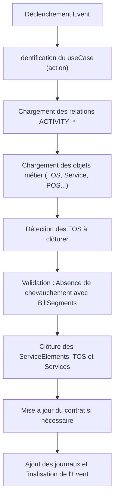


---


## 🔍 Modes de terminaison supportés


### 🔹 `BOTTOM_UP` – Depuis un POS


- Le POS est identifié via la relation `ACTIVITY_POS`

- On récupère tous les TOS actifs de même direction (`ctrPos.getDirection()`)

- On clôture chaque TOS :

- Fermeture des SE actifs

- Fermeture du service associé

- Mise à jour du contrat si tous les services sont terminés


### 🔹 `TOP_DOWN` – Depuis un contrat ou un service


- Le contrat est toujours présent (`ACTIVITY_CONTRACT`)

- Si un service est ciblé (`ACTIVITY_SERVICE`) → TOS du service

- Sinon → Tous les services actifs du contrat

- Pour chaque service :

- Récupération des TOS

- Clôture TOS + Service


### 🔹 `ONE_SELF` – Depuis un TOS


- Le TOS est ciblé directement via `ACTIVITY_TOS`

- Clôture du TOS seul, puis de son service et contrat liés


---


## ⚙️ Détails fonctionnels importants


### 🔸 Terminaison d’un TOS (`terminateTos`)

- Vérifie qu’il n’y a **aucun segment de facturation actif** postérieur (`BillSegment`)

- Clôture tous les SE actifs (`closeServiceElement`)

- Applique `PENDING_STOP` ou `CANCELLED` selon dates


### 🔸 Terminaison d’un Service

- Vérifie l’absence de TOS restants actifs

- Applique statut et `endDate` logique


### 🔸 Terminaison d’un Contrat

- Vérifie l’absence de services restants actifs

- Applique `contractualEndDate` si tout est terminé


---


## 📌 Règles de gestion


| Condition | Action |
|----------|--------|
| TOS `startDate == endDate` | Statut = `CANCELLED` |
| BillSegments actifs trouvés | Blocage avec exception |
| Services ou TOS restants actifs | Aucune clôture contrat/service |
| `BOTTOM_UP` sans TOS trouvés | Ne bloque pas, journalise l’absence |

---


## 🧠 Exemple 


> Un POS arrive à échéance.

> Le moteur déclenche le tag en mode `BOTTOM_UP`.

> Tous les TOS de ce POS sont récupérés et terminés.

> Les services associés sont clôturés.

> Le contrat est clôturé si tous les services sont terminés.

> Journaux métiers : `TOS_CLOSED`, `SERVICE_CLOSED`, `CONTRACT_UPDATED`


---


## 📝 Journalisation


Chaque entité modifiée déclenche un `JournalAction.LOG` avec les informations suivantes :

- Type d’objet (`TOS`, `SERVICE`, `CONTRACT`)

- ID de l’objet

- Code journal (`TOS_CLOSED`, `SERVICE_CLOSED`, etc.)

- ID de l’événement déclencheur


---


## 📘 Glossaire


| Terme | Définition |
|-------|------------|
| `TOS` | Terme de service (période de validité d’un service) |
| `SE` | Éléments de service facturables |
| `POS` | Point de service (site ou compteur) |
| `LauncherFatalException` | Exception métier bloquante |
| `BillSegment` | Segment de facturation calculé ou facturé |
| `JournalUtils` | Outil de traçabilité des actions |

---


## ✅ Résumé


Ce tag encapsule toute la logique de **résiliation multigrain** d’un contrat ou service :

il garantit une fermeture rigoureuse, cohérente, conditionnelle et tracée.

C’est une **clé de voûte fonctionnelle** du moteur d’automatisation de Billariz.


---


# Calcul du cyvle de facturation

---

Tag `ComputeBillingCycle`


---


## 🧭 Contexte général


Le tag `ComputeBillingCycle` est une fonction plugin du moteur d’automatisation Billariz.

Il calcule et applique dynamiquement un **cycle de facturation** (`BillingCycle`) à un contrat ou à son périmètre, en fonction :


- de la configuration du Point of Service (`POS`)

- du cycle de relève (`ReadingCycle`)

- de la fréquence de facturation (`BillingFrequency`)

- et de paramètres système (offsets, minimum days, etc.)


Il garantit une cohérence entre les données contractuelles, les fréquences de lecture, et les règles métier de facturation.


---


## 🎯 Objectifs fonctionnels


- Identifier le contrat cible via la relation `ACTIVITY_CONTRACT`

- Récupérer la configuration du POS actif (fréquence, période)

- Calculer le `ReadingCycle` associé

- Déterminer le `BillingCycle` du contrat via une table de correspondance

- Appliquer une date de `billAfterDate` cohérente à partir de paramètres globaux

- Appliquer les mêmes calculs au périmètre s’il est facturable

- Gérer et tracer les erreurs métier via le `Journal`


---


## 🔁 Cycle fonctionnel illustré


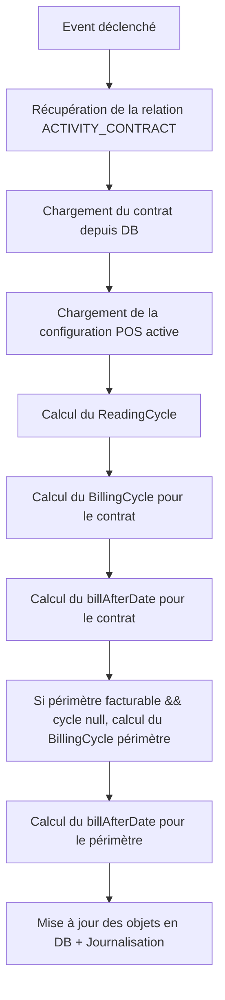


---


## ⚙️ Règles métier détaillées


### 1. 🎯 Relation contractuelle (`ACTIVITY_CONTRACT`)


- Le tag recherche une relation de type `ACTIVITY_CONTRACT` associée à l’`Event`

- L’absence de cette relation bloque le traitement


🛑 **Erreur levée** : `MISSING_CONTRACT`


---


### 2. 📄 Chargement du contrat


- Le contrat est récupéré via l’ID de la relation

- L’absence du contrat en base déclenche une exception


🛑 **Erreur levée** : `MISSING_CONTRACT_IN_DB`


---


### 3. ⚙️ Chargement de la configuration POS


- Recherche la dernière configuration POS (`endDate = null`)

- Elle doit être unique et active


🛑 **Erreur levée** : `MISSING_POS_CONF`


---


### 4. 📅 Calcul du `ReadingCycle`


Utilise la combinaison :

- `readingPeriod`

- `readingFrequency`

- `market`


Les données sont recherchées dans la table de mapping `ReadingPeriodReadingCycle`.


🛑 **Erreur levée** : `MISSING_READING_CYCLE`


---


### 5. 🔁 Calcul du `BillingCycle` (contrat)


Basé sur :

- Le `ReadingCycle` déterminé

- La `BillingFrequency` du contrat


Recherche dans la table `ReadingCycleBillingCycle`.


🛑 **Erreur levée** : `MISSING_BILLING_CYCLE`


---


### 6. 📆 Calcul de la date de facturation au plus tard - `billAfter`


Basé sur trois paramètres système :


| Paramètre | Description |
|-----------|-------------|
| `badOffset` | Nombre de jours entre début de fenêtre et date autorisée de facturation |
| `windowOffset` | Délai supplémentaire après ouverture de la fenêtre |
| `minDayOpenWindow` | Délai minimum entre la date actuelle et la fenêtre cible |

L’algorithme `findNextBillingWindowStartDate` applique des règles différentes selon la fréquence :


- `MONTHLY` → jour du mois

- `BIMONTHLY`, `BIANNUAL`, `ANNUAL` → date complète `dd/MM`


---


### 7. 🔁 Traitement du périmètre


Si :

- le périmètre est `billable`

- et ne possède pas encore de `BillingCycle`


Alors :

- on applique un `BillingCycle` calculé de la même manière

- on applique une date `billAfterDate`


---


## 🧾 Liste des erreurs métier


| Code | Description | Condition déclenchante |
|------|-------------|------------------------|
| `MISSING_CONTRACT` | Pas de relation `ACTIVITY_CONTRACT` | Aucune relation associée à l’événement |
| `MISSING_CONTRACT_IN_DB` | Le contrat est introuvable | L’ID ne correspond à rien en base |
| `MISSING_POS_CONF` | POS non configuré ou clôturé | Aucun `PointOfServiceConfiguration` actif |
| `MISSING_READING_CYCLE` | Aucun cycle de lecture correspondant | La table de mapping ne contient pas la combinaison |
| `MISSING_BILLING_CYCLE` | Aucune correspondance lecture/facturation | La table `ReadingCycleBillingCycle` ne renvoie rien |


---


## 📘 Glossaire


| Terme | Définition |
|-------|------------|
| `BillingCycle` | Fréquence réelle de facturation appliquée |
| `ReadingCycle` | Fréquence de lecture des consommations |
| `billAfterDate` | Date minimale à partir de laquelle une facture peut être émise |
| `LauncherFatalException` | Exception bloquante levée pour forcer l’arrêt d’un tag |
| `POS` | Point of service lié au contrat |
| `BillingWindow` | Fenêtre temporelle de facturation |
| `ParameterRepository` | Référentiel des paramètres globaux |


---


## ✅ Résumé


Ce tag est un **composant de calcul intelligent** qui adapte dynamiquement les paramètres de facturation du contrat et de son périmètre selon la configuration POS.

Il applique une série de **vérifications métiers strictes** et assure une **traçabilité complète** des erreurs et des décisions via le `Journal`.


---


# Mise à jour de la configuration du point de service

---

Tag `UpdatePosMasterData`


---


## 🧭 Contexte général


Le tag `UpdatePosMasterData` est utilisé dans le moteur Billariz pour **mettre à jour les données de référence** liées à un ou plusieurs points de service (`PointOfService`).

Il est déclenché dans le cadre d'une activité, et peut intervenir selon deux scénarios :

- **Traitement descendant** (lié à un contrat) : tous les POS du contrat sont traités

- **Traitement ascendant** (lié à un POS) : seul le POS explicitement ciblé est traité


Il applique une **logique de clôture** des données techniques : capacité, configuration, estimation, et compteurs.


---


## 🎯 Objectifs fonctionnels


- Identifier les points de service concernés par une activité donnée

- Déterminer la **date de fin** de validité pour chacun

- Clôturer les données liées (capacités, configurations, estimations, compteurs)

- Tracer l’opération via le journal

- Bloquer l’activité si une erreur critique est détectée (clôture incomplète ou incohérente)


---


## 🔁 Cycle fonctionnel


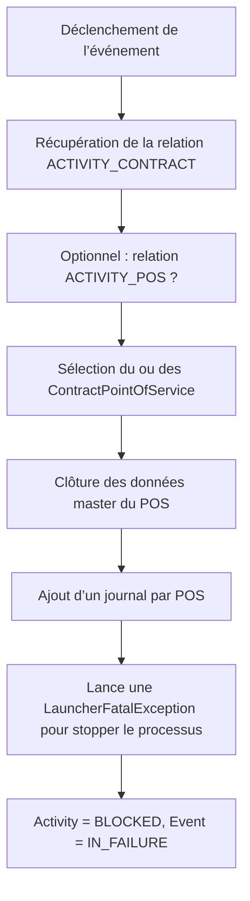


---


## 🔍 Détail du traitement


### 1. Chargement des relations


- La relation `ACTIVITY_CONTRACT` est **obligatoire**. Si absente → `MISSING_CONTRACT`

- La relation `ACTIVITY_POS` est **optionnelle**. Si présente, elle indique un traitement ascendant.


### 2. Récupération des POS concernés


- Si `ACTIVITY_POS` est présent → récupération unique du `ContractPointOfService` correspondant

- Sinon → récupération de **tous les POS liés au contrat**


### 3. Détermination de la date de clôture


- Cas ascendant : `cp.getEndDate()`

- Cas descendant : `contract.getContractualEndDate()`


---


## ⚙️ Fermeture des objets techniques


La méthode `closePointOfServiceMasterData(...)` applique :

- Fermeture des **capacités** (`closeCapacities`)

- Fermeture des **configurations** (`closeConfigurations`)

- Fermeture des **estimations** (`closeEstimates`)

- Clôture de **tous les compteurs** (`endDate` forcée si manquante)


📌 Statut appliqué :

- `CANCELLED` si `startDate == endDate`

- Sinon : `CLOSED`


---


## 💥 Gestion des erreurs


Dès qu’un POS est clôturé :

- Un journal de type `ENDING_POS` est ajouté

- Une exception `LauncherFatalException` est lancée avec le code `POS_CONF_ENDING`

- Le statut de l’événement passe à `IN_FAILURE`

- L’activité passe à `BLOCKED`


---


## 🧠 Exemple narratif


> Une activité demande la clôture technique d’un contrat de gaz.

> Aucun POS spécifique n’est ciblé → tous les POS du contrat sont traités.

> Pour chaque POS :

> - On ferme les données (capacités, estimations, etc.)

> - On log l’opération

> - L’événement est arrêté par une exception volontaire, indiquant que l’étape a été réalisée.


---


## 📘 Glossaire


| Terme | Définition |
|-------|------------|
| `PointOfService` | Installation ou site physique à gérer |
| `ContractPointOfService` | Association entre contrat et POS |
| `LauncherFatalException` | Exception métier bloquante déclenchant l’arrêt |
| `PointOfServiceDataStatus` | Statut d’un POS (`CLOSED`, `CANCELLED`) |
| `ACTIVITY_CONTRACT` | Lien entre une activité et un contrat |
| `ACTIVITY_POS` | Lien entre une activité et un POS spécifique |

---


## ✅ Résumé


Ce tag est un **outil de gestion de la clôture technique des POS**, déterministe et sécurisé.

Il applique une politique stricte :

- un seul appel = une clôture effective

- journalisation immédiate

- arrêt contrôlé via exception métier


C’est une **étape terminale typique** dans les processus de résiliation ou de transfert de contrat.


---


# Validation des relevés de compteur

---

Tag `ValidateMeterRead`


---


## 🧭 Contexte général


Dans le cadre du moteur d’automatisation de Billariz, le tag `ValidateMeterRead` est une **brique critique de validation des données de consommation**.

Il intervient en amont de la facturation pour garantir que les données issues des relevés (`MeterRead`) sont :


- **Fiables**

- **Cohérentes avec le contrat**

- **Continues dans le temps**

- **Non redondantes**

- **Conformes aux seuils métier configurés**


Ce tag agit comme un **filtre intelligent** chargé de **bloquer les erreurs en amont** et de **protéger le système de facturation contre des anomalies métiers**.


---


## 🎯 Objectif du tag


- Identifier si le `MeterRead` en cours est **applicable**

- Déterminer s’il est **cohérent avec les données historiques et contractuelles**

- **Recalculer ou rejeter** la donnée si besoin

- **Relancer automatiquement** les événements précédemment échoués

- **Tracer toutes les actions** via le module de journalisation


---


## 🛠️ Étapes fonctionnelles détaillées


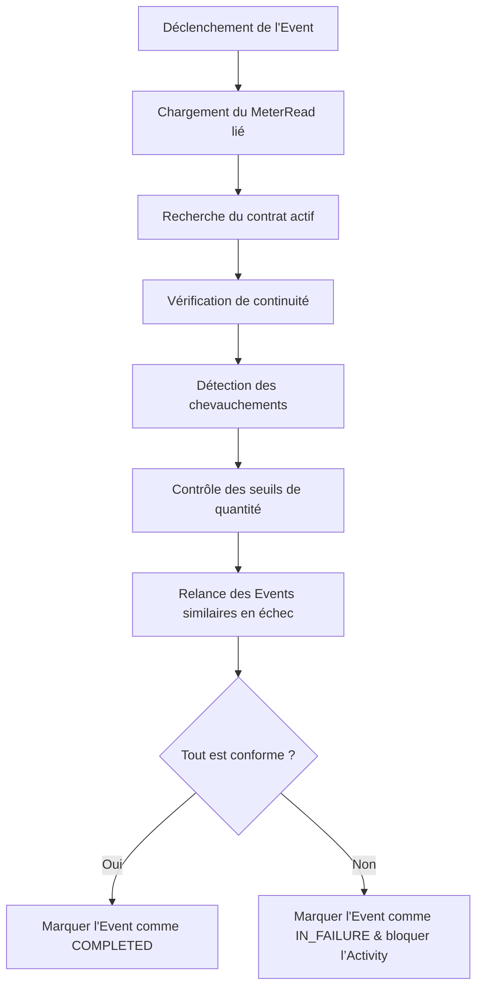


---


## 🔎 Contrôles métier expliqués


### 🔹 1. Vérification du contrat (`checkContract`)

Objectif : **S’assurer que le relevé est rattaché à un contrat valide**.


#### ✅ Règle :

- Le `MeterRead` possède un `posRef`

- On retrouve un `ContractPointOfService` actif dont la période englobe celle du `MeterRead`


#### 💥 Sinon :

- Le `MeterRead` est marqué `IN_FAILURE`

- Un message de journal est créé : `MISSING_CONTRACT_FOR_MR`


#### 🧠 Exemple :

> Le relevé couvre le 1er au 30 avril. Le contrat est actif du 5 avril au 30 décembre. ❌ Le relevé n’est pas valide.


---


### 🔹 2. Vérification de continuité (`checkContinuity`)


Objectif : **Détecter une rupture anormale dans la chaîne des consommations**.


#### ✅ Règle :

- Une `toleranceDays` (ex : ±3 jours) est configurée via paramètre `continuityToleranceDays`

- Il doit exister un `MeterRead` précédent **dans cette tolérance**


#### 💥 Sinon :

- Le relevé est rejeté pour discontinuité (`CHECK_CONTINUITY_KO`)


#### 🧠 Exemple :

> Le précédent relevé s’est terminé le 30 mars, le suivant commence le 10 avril.

Avec une tolérance de 3 jours, la rupture est de 10 jours → ❌ rejet.


---


### 🔹 3. Vérification des chevauchements (`checkOverlap`)


Objectif : **Empêcher des doublons ou conflits de période**.


#### ✅ Règle :

- Pour un `INITIAL`, aucun autre `INITIAL` non annulé ne doit exister sur la même période

- Des tolérances d’intervalle sont configurées via `overlapToleranceDays`


#### 💥 Sinon :

- Le `MeterRead` est rejeté, ou l’ancien `ESTIMATE` est annulé

- Journal : `CHECK_OVERLAP_KO`, `CANCELED_ESTIMATE_MR`


#### 🧠 Exemple :

> Deux `INITIAL` se chevauchent du 15 au 20 avril → ❌ l’un est annulé automatiquement s’il est estimé


---


### 🔹 4. Vérification des seuils de consommation (`checkThreshold`)


Objectif : **Éviter des valeurs aberrantes**.


#### Étapes :

1. Déterminer la `usualQuantity`

- Si 12 mois d’historique : utiliser l’historique réel

- Sinon : utiliser une estimation (`MARKET`, `SUPPLIER`)

2. Appliquer les pourcentages de tolérance (configurés dans les paramètres)

3. Calculer les bornes autorisées

4. Comparer la `totalQuantity` mesurée


#### ✅ Formules :

```text

lowerBound = usualQuantity * (1 - moinsTolérance%)

upperBound = usualQuantity * (1 + plusTolérance%)

```


#### 💥 Si dépassement :

- Le `MeterRead` est rejeté

- Journal : `QUANTITY_OUT_OF_BOUNDS`


#### 📊 Exemple illustré :


```text

Usual quantity = 1000 kWh

+10% tolerance → upper = 1100 kWh

-15% tolerance → lower = 850 kWh


totalQuantity = 1200 kWh → ❌ rejeté

totalQuantity = 950 kWh → ✅ accepté

```


---


### 🔹 5. Relance des événements similaires en échec


Objectif : **Augmenter la résilience métier du moteur.**


- Le système recherche tous les événements ayant :

- le même type

- le même contrat

- un statut `IN_FAILURE`

- Ils sont replanifiés (`PENDING`) automatiquement


---


## 📌 Paramètres système utilisés


| Paramètre | Description |
|-----------|-------------|
| `quantityUpTolerancePercentage` | Marge haute tolérée sur la consommation |
| `quantityLessTolerancePercentage` | Marge basse tolérée |
| `continuityToleranceDays` | Tolérance de continuité entre deux relevés |
| `overlapToleranceDays` | Tolérance pour détecter les conflits de période |

---


## 🧠 Cas d’usage narratif


> 🔧 Environnement : Relevé de consommation reçu le 1er juin pour un client résidentiel.

> 🔍 Objectif : S’assurer que ce relevé est compatible avec la logique de facturation.


1. Le système vérifie que le client a un contrat actif : ✅ OK

2. Il regarde si un relevé précédent est bien présent sans interruption : ✅ OK

3. Il trouve un chevauchement estimé → 🔄 l’annule automatiquement

4. Il détecte une valeur de consommation trop élevée : ❌ rejet avec message `QUANTITY_OUT_OF_BOUNDS`


---


## 🧾 Journalisation


Chaque étape importante est enregistrée dans un `Journal` métier, avec :

- L’objet concerné (`MeterRead`, `Contract`, etc.)

- Un code de message (`MISSING_MR`, `CHECK_OVERLAP_KO`, etc.)

- Des arguments explicites

- Une action (`LOG`, `ERROR`)


---


## ✅ Résumé fonctionnel


Le tag `ValidateMeterRead` permet :


✔ De **fiabiliser le traitement en amont** de la facturation

✔ De **bloquer les incohérences** de données clients

✔ De **relancer intelligemment** les traitements échoués

✔ D’**aider au support métier** grâce à une journalisation complète


---


# Validation des charges 

---

Tag `ValidateBillableCharge`


---


## 🧭 Contexte général


Le tag `ValidateBillableCharge` est une fonction plugin métier du moteur Billariz utilisée pour **valider une charge facturable** (`BillableCharge`) avant qu’elle ne soit effectivement considérée dans le cycle de facturation.

Il agit en tant que **garde-fou métier** permettant de détecter des incohérences contractuelles, des chevauchements ou des ruptures de continuité sur des charges de type `INITIAL`, `CANCELLATION` ou `CORRECTION`.


---


## 🎯 Objectifs fonctionnels


- Valider la cohérence entre une charge facturable et un contrat actif

- Vérifier la **continuité** des charges dans le temps (tolérance configurable)

- Détecter les **chevauchements** entre plusieurs charges

- Gérer la logique métier de **remplacement automatique** d’estimations

- Relancer des événements similaires précédemment en échec

- Documenter toutes les décisions via `Journal`


---


## 🔁 Cycle fonctionnel


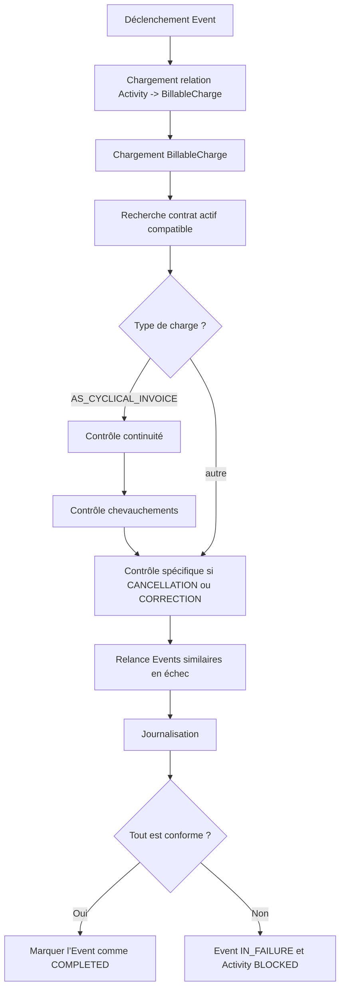


---


## 🔎 Étapes métier détaillées


### 1. Chargement de la `BillableCharge`


Le tag commence par retrouver la `BillableCharge` liée à l’`Activity` de l’événement via une relation `ACTIVITY_BILLABLE_CHARGE`.


#### Erreur levée :

- `NO_BC_FOUND` si la relation n'existe pas

- `MISSING_BC` si la charge n’est pas trouvée en base


---


### 2. Vérification du contrat (`checkContract`)


Cherche dans les `ContractPointOfService` un contrat actif qui couvre la période de la `BillableCharge`.


#### Critère métier :

- La période de la charge doit être contenue dans celle du contrat (en tenant compte des dates de début/fin)


#### Erreur levée :

- `MISSING_CONTRACT_FOR_BC` → la charge est placée en `IN_FAILURE`


---


### 3. Vérification de la continuité (`checkContinuity`)


Applicable uniquement si l’acquisition de la charge est `AS_CYCLICAL_INVOICE`.


- Le système cherche une autre `BillableCharge` du même contrat dans une plage de jours définie autour de la date de début.

- Paramètre système : `continuityToleranceDays`


#### Erreur levée :

- `BC_CHECK_CONTINUITY_KO` si aucune charge voisine acceptable n’est trouvée


---


### 4. Vérification des chevauchements (`checkOverlap`)


#### Logique selon le type :


- `INITIAL` :

- Ne doit pas chevaucher une autre `INITIAL` non annulée

- Si elle chevauche une `ESTIMATE` : l’estimation est annulée et journalisée


- `CANCELLATION` :

- Doit retrouver une `INITIAL` existante couvrant la même période


- `CORRECTION` :

- Doit retrouver une `CANCELLATION` existante couvrant la même période


- Paramètre : `overlapToleranceDays` utilisé pour élargir la fenêtre de contrôle


#### Erreurs levées :

- `BC_CHECK_OVERLAP_KO`

- `NO_INITIAL_BC`

- `NO_CANCELLATION_BC`


---


## 🔄 Relance d’événements similaires (`activateEventsInFailure`)


- Recherche tous les événements de même type, liés au contrat en erreur

- Met à jour leur statut à `PENDING` pour une relance automatique

- Permet de fluidifier le cycle en cas de correction manuelle ou intervention métier


---


## 📝 Journalisation


Chaque étape est tracée dans un `Journal` métier associé à la charge ou à l’événement :


- Ajout de `messageCode` pour chaque validation réussie

- Ajout de `JournalAction.ERROR` pour les blocages

- Exemples : `CHECK_CONTRACT_OK`, `BC_CHECK_CONTINUITY_KO`, `CANCELED_ESTIMATE_BC`


---


## ⚙️ Paramètres utilisés


| Code | Description |
|------|-------------|
| `continuityToleranceDays` | Nombre de jours max entre deux charges contiguës |
| `overlapToleranceDays` | Fenêtre d’analyse pour détection des chevauchements |

---


## 📘 Glossaire


| Terme | Définition |
|-------|------------|
| `BillableCharge` | Unité de charge à facturer |
| `ContractPointOfService` | Lien entre contrat et périmètre |
| `LauncherFatalException` | Exception critique bloquante |
| `Journal` | Historique métier tracé |
| `Cascaded` | Marque une propagation d’état technique |


---


## ✅ Résumé


Le tag `ValidateBillableCharge` est un **filet de sécurité avancé** du moteur Billariz pour garantir que chaque charge envoyée à la facturation respecte :


- Les contraintes contractuelles

- L’enchaînement temporel

- La non-redondance

- Et la logique fonctionnelle du type de charge


Il permet ainsi de **préserver la cohérence du système de facturation**, tout en facilitant la **détection proactive des erreurs**.


---


# Mise à jour du statut d'une charge facturable

---

Tag `UpdateBillableChargeStatus`


---


## 🧭 Contexte général


Le tag `UpdateBillableChargeStatus` est utilisé dans Billariz pour gérer le **cycle de vie des charges facturables (`BillableCharge`)**.

Il repose sur un moteur de règles (`ObjectProcessRule`) permettant de définir, de manière déclarative, **les transitions de statut possibles**, et les actions à déclencher automatiquement en réponse.


Il joue un rôle clé dans l’automatisation des traitements, la journalisation métier, et le déclenchement d’actions correctives ou de suivi.


---


## 🎯 Objectifs fonctionnels


- Identifier et charger la `BillableCharge` associée à l’événement

- Rechercher une règle métier (`ObjectProcessRule`) de changement de statut

- Appliquer la transition de statut si la règle est trouvée

- Journaliser l’action

- Déclencher d’autres activités automatiquement si défini

- Répéter la logique sur toutes les charges annulées par la charge courante


---


## 🔁 Cycle fonctionnel


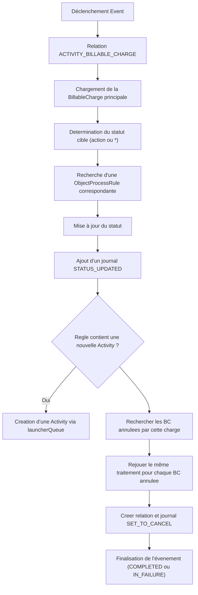


---


## ⚙️ Étapes métier détaillées


### 1. Chargement de la `BillableCharge`


- Le tag cherche la relation `ACTIVITY_BILLABLE_CHARGE` pointant vers une `BillableCharge`.

- Si elle est manquante → `LauncherFatalException("NO_BC_FOUND")`

- Si l’objet cible est introuvable → `LauncherFatalException("MISSING_BC")`


---


### 2. Détermination du statut cible


- Si l’action de l’événement est vide, on utilise `"*"` comme valeur joker

- Sinon, on applique directement `event.getAction()` comme statut cible recherché


---


### 3. Recherche d’une `ObjectProcessRule`


- Filtrée sur :

- `ObjectType = BILLABLE_CHARGE`

- `initialStatus` = statut actuel (ou `null`)

- `newStatus` = valeur d’action

- `market` et `direction` compatibles ou génériques (`*`)


- Si aucune règle ne correspond → `LauncherFatalException("NO_RULE_FOUND")`


---


### 4. Application de la règle


- La `BillableCharge` reçoit le `finalStatus` défini dans la règle

- Le changement est **persisté immédiatement**

- Un journal est créé via `JournalUtils` :

- Type : `STATUS_CHANGE`

- Message : `STATUS_UPDATE_BY_RULE`

- Code journal : `STATUS_UPDATED`


---


### 5. Création automatique d’une `Activity`


- Si la règle contient un `activityType`, une `Activity` est créée :

- avec le type défini

- objet = `BillableCharge`

- déclenchée par `"systemAgent"`


---


### 6. Traitement des `BillableCharge` annulées


- Le tag cherche toutes les `BillableCharge` annulées par la charge courante

- Pour chacune :

- Application d’une règle `"CANCELLED"`

- Création d’une activité si applicable

- Ajout de la relation `ACTIVITY_BILLABLE_CHARGE`

- Ajout du journal `SET_TO_CANCEL`


---


## 📘 Glossaire


| Terme | Définition |
|-------|------------|
| `BillableCharge` | Charge facturable à un client |
| `ObjectProcessRule` | Règle de changement de statut dynamique |
| `LauncherQueue` | Composant de création d’événement ou activité |
| `JournalAction.STATUS_CHANGE` | Action de traçabilité d’une transition |
| `ACTIVITY_BILLABLE_CHARGE` | Lien entre une `Activity` et une `BillableCharge` |
| `LauncherFatalException` | Exception métier bloquante |

---


## ✅ Résumé


Ce tag permet de piloter les statuts de `BillableCharge` de manière **flexible et déclarative**, tout en :

- automatisant les enchaînements d’activités,

- journalisant les transitions,

- assurant la cohérence des statuts liés (BC annulées),

- garantissant la traçabilité totale des décisions prises.


C’est un **élément fondamental du moteur métier de Billariz**.


---


# Mise à jour du statut d'un relevé de compteur

---

Tag `UpdateMeterReadStatus`


---


## 🧭 Contexte général


Le tag `UpdateMeterReadStatus` permet de **mettre à jour dynamiquement le statut d’un ou plusieurs `MeterRead`** en s’appuyant sur un ensemble de règles préconfigurées (`ObjectProcessRule`).

Il est conçu pour exécuter un **enchaînement de traitements métiers automatisés** à partir du statut courant d’un relevé et d’une action déclenchée via un `Event`.


Il agit comme un moteur de transitions d’état déclaratif et conditionnel, orienté par configuration.


---


## 🎯 Objectifs fonctionnels


- Identifier les `MeterRead` liés à une `Activity`

- Déterminer la règle métier applicable via `ObjectProcessRule`

- Mettre à jour leur statut selon les conditions de marché et direction

- Tracer la transition dans un `Journal`

- Créer éventuellement de nouvelles `Activity` (règles réactives)

- Gérer les `MeterRead` annulés par le courant


---


## 🔁 Cycle fonctionnel


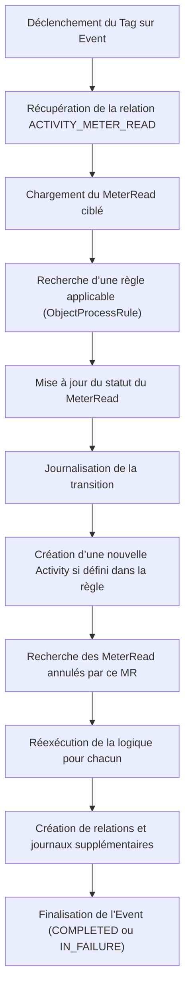


---


## ⚙️ Détails métier


### 🔹 1. Source d’entrée


- Le `Event` fournit l’`Activity` et une action (ex: `CANCELLED`, `VALIDATED`, etc.)

- La relation `ACTIVITY_METER_READ` permet de récupérer le `MeterRead` ciblé

- Si absente → levée de `LauncherFatalException(NO_MR_FOUND)`


---


### 🔹 2. Application des règles métier (`ObjectProcessRule`)


Les règles de transition de statut sont configurées via l’objet `ObjectProcessRule`, filtrées par :


- `objectType = METER_READ`

- `initialStatus` (optionnel) = statut courant

- `newStatus` = action déclenchée

- `finalStatus` = statut à appliquer

- `market` et `direction` (avec jokers `*`)


📌 Si aucune règle ne correspond → levée d'une exception `NO_RULE_FOUND`.


---


### 🔹 3. Mise à jour du statut


Une fois la règle trouvée :

- Le statut du `MeterRead` est mis à jour selon `finalStatus`

- Un journal est ajouté : `"STATUS_UPDATED"`

- Un message métier est loggé : `"STATUS_UPDATE_BY_RULE"`


---


### 🔹 4. Réactions dynamiques : création d’activité


- Si la règle contient un `activityType` → déclenchement automatique via `launcherQueue`

- La nouvelle activité est liée au `MeterRead` avec le type et l’agent `"systemAgent"`


---


### 🔹 5. Cas des `MeterRead` annulés


- Tous les `MeterRead` annulés par celui-ci sont récupérés

- Le même traitement (`updateMeterReadStatus`) est appliqué

- Journaux + relations sont ajoutés pour traçabilité

- Permet de boucler le cycle d’annulation proprement


---


## 📝 Journalisation


Chaque action métier est tracée dans un `Journal` :

- `STATUS_UPDATED` sur le MR principal

- `SET_TO_CANCEL` pour chaque MR annulé

- Contient les `messageCode` liés à la règle utilisée


---


## 📘 Glossaire


| Terme | Définition |
|-------|------------|
| `MeterRead` | Relevé de consommation (réel ou estimé) |
| `ObjectProcessRule` | Règle de transition d’état métier |
| `LauncherFatalException` | Exception bloquante critique |
| `launcherQueue` | Mécanisme de création d’événements/activités |
| `ACTIVITY_METER_READ` | Type de relation entre une `Activity` et un `MeterRead` |
| `JournalAction.STATUS_CHANGE` | Action enregistrée lors du changement de statut |


---


## ✅ Résumé


Ce tag transforme le `MeterRead` en **objet piloté par règles de transition**, permettant :


- Un pilotage déclaratif de son cycle de vie

- Une réactivité métier (enchaînements automatisés)

- Une propagation cohérente des effets métier sur les objets liés

- Une robustesse via journalisation et traçabilité fine


---


# Facturation - étape de calcul

---

Tag `BillingCompute`


---


## 🧭 Contexte général


Le tag `BillingCompute` est l’un des composants centraux du moteur de facturation Billariz.

Il est chargé de **générer les factures (Bill)** à partir des segments de facturation (`BillSegment`) préalablement calculés,

en traitant aussi bien les cas de factures individuelles que les **factures de groupe**,

et gérant les cas spécifiques comme les **avoirs (CREDIT_NOTE)**.


Il assure également la **mise à jour des statuts** des objets liés (`MeterRead`, `BillableCharge`, `BillSegment`),

la gestion de la **TVA**, le regroupement des lignes de facturation (`BillDetail`), et la création des relations avec l’activité en cours.


---


## 🎯 Objectifs fonctionnels


- Identifier les contrats ou périmètres à facturer à partir d’une `Activity`

- Générer une ou plusieurs factures (`Bill`)

- Consolider les lignes de facturation issues de segments (`BillDetail`)

- Appliquer la logique de facturation : type, nature, statut

- Traiter les cas de CREDIT_NOTE

- Mettre à jour les statuts des entités métier liées

- Enregistrer un journal métier avec les messages d'exécution


---


## 🔁 Cycle fonctionnel


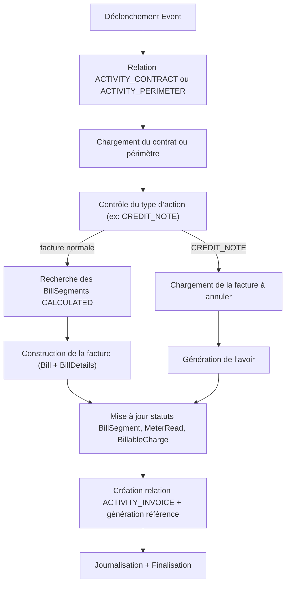


---


## ⚙️ Règles métier détaillées


### 🔹 1. Identification de la cible : contrat ou périmètre


- Le tag cherche d'abord une relation `ACTIVITY_CONTRACT`

- À défaut, une relation `ACTIVITY_PERIMETER`

- Si aucune n’est trouvée, le tag ne fait rien (mais ne lève pas d’erreur ici)


---


### 🔹 2. Traitement des factures normales


#### a. Facturation sur contrat


- Récupère les `BillSegment` avec statut `CALCULATED` pour les TOS du contrat

- Pour chaque `BillSegment`, création d’un `BillDetail`

- Les montants sont consolidés, groupés par taux de TVA

- Calcul de la `totalWithoutVat`, `totalVat`, `totalAmount`


#### b. Facturation groupée sur périmètre


- Récupère toutes les `Bill` de statut `CALCULATED` pour le périmètre

- Fusionne les lignes des factures enfants

- Crée une `groupBill` consolidée avec une nouvelle référence

- Met à jour les factures enfants (`groupBillId`)


---


### 🔹 3. Traitement des CREDIT_NOTE


- Charge la facture à annuler (via relation `ACTIVITY_INVOICE`)

- Génère une nouvelle `Bill` en inversant toutes les lignes (`BillDetail`)

- Inverse aussi les montants de TVA

- Marque la facture initiale comme `CANCELED`

- Et la lie à l’avoir généré (`cancelledByBillId` / `cancelledBillId`)


---


### 🔹 4. Détermination du type de facture (`BillType`)


- Si la `endDate` de la facture = `contract.contractualEndDate` → `FINAL`

- Sinon :

- Si une `BillingRun` est liée → `CYCLICAL`

- Sinon → `EVENT`


---


### 🔹 5. Mise à jour des objets liés


- Tous les `BillSegment` sont mis à jour :

- `status` = `COMPUTED`

- `billId` = nouvelle facture


- Tous les `MeterRead` liés sont mis à jour en `COMPUTED`

- Tous les `BillableCharge` liés sont mis à jour en `COMPUTED`


---


## 🧾 Liste des erreurs métier


| Code | Description | Condition déclenchante |
|------|-------------|------------------------|
| `MISSING_CONTRACT_IN_DB` | Contrat non trouvé en base | ID fourni dans la relation `ACTIVITY_CONTRACT` |
| `MISSING_BS_TO_COMPUTE` | Aucun `BillSegment` à traiter | Aucun segment `CALCULATED` trouvé |
| `MISSING_PARAMETER` | Taux de TVA absent dans les paramètres | Clé `VAT_RATE_INDEX` non trouvée |
| `MISSING_ACTIVITY_INVOICE` | Aucune relation `ACTIVITY_INVOICE` | Cas de CREDIT_NOTE mal préparé |
| `MISSING_BILL_IN_DB` | Facture à annuler introuvable | Mauvais ID dans la relation |
| `MISSING_BILL_TO_CANCEL` | Idem ci-dessus (cas périmètre) | ID invalide |
| `MISSING_CHILD_BILLS` | Pas de factures enfants à consolider | Cas groupé avec `groupBillId` sans enfants |
| `MISSING_BILLS_FOR_PERIMETER` | Pas de factures à grouper sur le périmètre | Cas standard groupé sans données |
| `MISSING_VAT_RATE` | Aucun taux de TVA trouvé en base | Paramétrage de la base erroné |
| `MISSING_VAT_RATE_VALUES` | Aucun tarif valide pour le taux de TVA | Aucun taux applicable aux données |

---


## 📝 Journalisation


- Un `Journal` est créé en début de traitement

- Statut final (`COMPLETED` ou `IN_FAILURE`) enregistré

- Codes de message accumulés

- `JournalAction.ERROR` utilisé si une exception est levée


---


## 📘 Glossaire


| Terme | Définition |
|-------|------------|
| `Bill` | Facture générée pour un contrat ou groupe |
| `BillDetail` | Ligne d'une facture représentant un élément valorisé |
| `BillSegment` | Élément calculé lors de la valorisation |
| `CREDIT_NOTE` | Avoir généré pour annuler une facture |
| `GroupBill` | Facture consolidée à partir de factures enfants |
| `LauncherFatalException` | Exception bloquante métier |
| `MeterRead` | Relevé de consommation lié à une ligne |
| `BillingRun` | Campagne de facturation cyclique |

---


## ✅ Résumé


Le tag `BillingCompute` est responsable de la **génération finale des factures dans Billariz**,

en consolidant les segments de valorisation, en appliquant les règles de calcul de TVA,

et en traitant les cas spécifiques de regroupement ou d’annulation.

Il est **l’ultime étape de production du document de facturation**, clé pour les processus de génération PDF, envoi et intégration comptable.


---


# Facturation - étape de valorisation

---

Tag `BillingValuation`


---


## 🧭 Contexte général


Le tag `BillingValuation` est un composant stratégique du moteur Billariz permettant de **déclencher l’évaluation (valuation) de services facturables (ServiceElement)** pour un contrat donné.

Il s’agit de l’étape préliminaire au calcul des segments de facturation, déterminant **quels éléments sont éligibles à être valorisés**, en fonction de :


- la base de valorisation (`BillingValuationBase`) portée par l’événement,

- l’état des services rattachés au contrat,

- la présence de relevés (`MeterRead`) ou de charges (`BillableCharge`) disponibles,

- la configuration POS du contrat,

- les règles métier spécifiques aux catégories de services,

- la nature "maître" ou non d’un `ServiceElement`.


---


## 🎯 Objectifs fonctionnels


- Identifier le contrat concerné par l’`Activity`

- Récupérer les `ServiceElements` éligibles **de type maître** (`master = true`)

- Vérifier la compatibilité de la base de valorisation demandée (`valuationBase`)

- Appliquer les règles d’éligibilité aux éléments (consommation, charge, etc.)

- Gérer les dates limites et filtres métier

- Déclencher la création des **`BillSegments`** à partir des SE sélectionnés

- Gérer les erreurs et les transitions d’état d’événement et d’activité


---


## 🧠 Définition métier : SE maître vs non maître


- Un **ServiceElement maître** (`master = true`) est un élément de service **pilote** pour la valorisation.

Il porte les caractéristiques principales de valorisation (type, dates, POS…).


- Un **SE non maître** est un élément secondaire, **valorisé en cascade** ou à partir d’un maître.


📌 Le tag `BillingValuation` **ne traite que les SE maîtres** pour initier une valorisation.


---


## 🔁 Cycle d'exécution


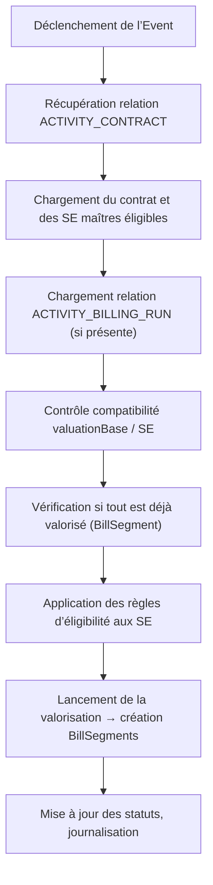


---


## ⚙️ Règles métier détaillées


### 🔹 Bases de valorisation prises en charge


- `FULL`, `FINAL_FULL`, `CUTOFF_DATE_FULL`

- `CONSUMPTION`, `CUTOFF_DATE_CONSUMPTION`

- `BILLABLE_CHARGE`, `CUTOFF_DATE_BC`

- `SUBSCRIPTION`, `CUTOFF_DATE_SUBSCRIPTION`


---


### 🔹 Vérification de compatibilité `valuationBase` / `SE`


> Objectif : vérifier qu’au moins un `SE` maître éligible correspond à la `valuationBase`.


- Si la base est `CONSUMPTION`, alors il faut un `SE` maître de type `CONSUMPTION`

- Si `BILLABLE_CHARGE` → un `SE` maître de type `BILLABLE_CHARGE`

- Si aucun ne correspond :

- Si base type `CUTOFF` → levée d’une **erreur bloquante**

- Sinon → message de warning + retour `PENDING`


---


### 🔹 Vérification de segments de facturation existants


Si un `BillingRun` est lié :


- Vérifie l’existence de `BillSegment` déjà générés pour ces SE maîtres

- Si tous sont déjà valorisés → **retour immédiat** (événement `COMPLETED`)


---


### 🔹 Éligibilité des `ServiceElements`


#### Pour un `SE` maître de type `CONSUMPTION` :


- Requiert la présence d’un `MeterRead` **de statut `AVAILABLE`**

- Le relevé doit couvrir la fenêtre temporelle autour de la date cible (`billingRun` ou date actuelle ± offset)


#### Pour un `SE` maître de type `BILLABLE_CHARGE` :


- Requiert l’existence de charges disponibles sur les POS du contrat (`BillableChargeStatus.AVAILABLE`)


#### Pour un `SE` maître de type `PAYMENT_PLAN` :


- Requiert un `BillSegment` antérieur non annulé

- Ce segment doit avoir une `endDate` passée dans la fenêtre admissible


---


## 🔁 Création des BillSegments


Une fois les SE maîtres validés et éligibles :


- La méthode `billingService.handleValuation(...)` est appelée

- Pour chaque SE maître, un ou plusieurs `BillSegments` sont créés

- Ces `BillSegments` contiennent :

- les montants valorisés

- les dates de période facturée

- les références à la source (SE, contrat, POS...)


---


## 🧾 Liste des erreurs métier


| Code | Signification | Condition |
|------|----------------|-----------|
| `MISSING_CONTRACT` | Aucun lien `ACTIVITY_CONTRACT` trouvé | Mauvais paramétrage de l’`Activity` |
| `MISSING_BILLABLE_SERVICES` | Aucun `SE` maître éligible trouvé pour le contrat | Aucun élément de facturation détecté |
| `MISSING_ELIGIBLE_SE_MASTERS` | Aucun `SE` compatible avec la `valuationBase` | Tous les SE sont hors scope métier |
| `ALL_SE_BILLED` | Tous les `SE` ont déjà été valorisés | Aucun traitement nécessaire |
| `NO_ELEMENTS_TO_BILL` | Aucune règle d’éligibilité n’a été satisfaite | Absence de relevés ou de charges |

---


## 📝 Journalisation


Chaque étape métier est enregistrée :


- Journal `STARTED` et `END` par événement

- Codes de messages accumulés (`messageCode`)

- En cas d’erreur : `JournalAction.ERROR`

- En cas de non-éligibilité : `messageCode` explicite mais sans erreur bloquante


---


## 📘 Glossaire


| Terme | Définition |
|-------|------------|
| `BillingValuationBase` | Base métier déclenchant un type de valorisation |
| `ServiceElement` | Élément de service facturable |
| `SE maître` | `ServiceElement` porteur de la valorisation |
| `MeterRead` | Relevé de consommation client |
| `BillingRun` | Campagne de facturation contenant une fenêtre temporelle |
| `BillSegment` | Segment de facturation issu de la valorisation |
| `ContractPointOfService` | Lien entre contrat et POS |
| `LauncherFatalException` | Exception bloquante |
| `EligibleServiceElement` | `SE` filtré selon les règles métier |
| `windowOffset` | Nombre de jours avant/après fenêtre pour relevés |

---


## ✅ Résumé


Ce tag implémente la **logique de validation et déclenchement des valorisations contractuelles** dans Billariz.

Il filtre les **SE maîtres**, applique les règles d’éligibilité et **crée les `BillSegments`** nécessaires à la facturation.

Il garantit une **traçabilité complète**, un contrôle strict des données d’entrée, et une exécution adaptée au cycle de facturation.


---


# Facturation - étape de validation

---

Tag `BillingValidation`


---


## 🧭 Contexte général


Le tag `BillingValidation` est utilisé pour **valider les factures générées** dans Billariz, en s’assurant que les totaux, les taux de TVA, les montants et les segments de facturation (`BillSegment`) sont **parfaitement cohérents**.

Il s’applique aux **factures simples et groupées**, et constitue une étape critique avant le passage en statut `VALIDATED` du document de facturation (`Bill`).


---


## 🎯 Objectifs fonctionnels


- Vérifier l’intégrité des données de facturation d’une `Bill`

- Valider les totaux par taux de TVA

- Vérifier la cohérence entre les lignes de facture et les segments (`BillSegment`)

- Appliquer des **seuils métiers** d’acceptation pour validation automatique

- Gérer les cas particuliers de **factures groupées**

- Journaliser toutes les décisions

- Passer la facture en statut `VALIDATED` si tout est conforme


---


## 🔁 Cycle fonctionnel global


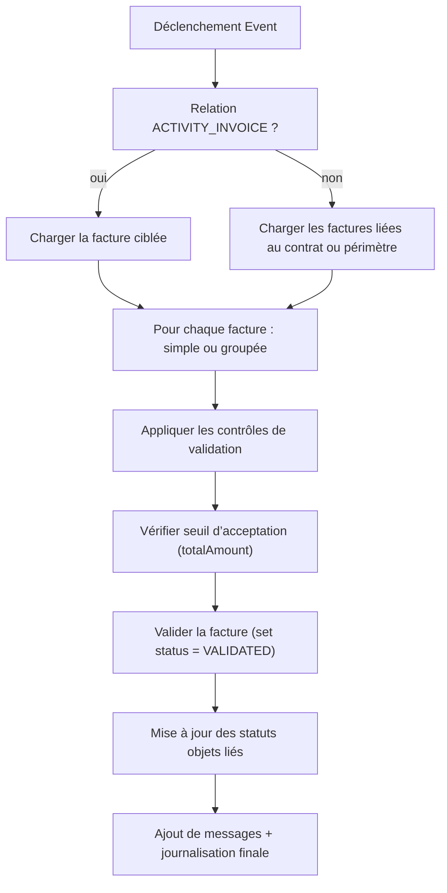


---


## ⚙️ Règles de validation métier


### 🔹 Contrôles sur facture simple


- Comparaison des totaux par taux de TVA :

- `bssTotalByVatMap` (totaux segments) vs `billLineTotalByVatMap` (lignes de facture)

- `VALIDATION_VAT_LINES_MISMATCH`


- Vérification que :

- `somme lignes = totalWithoutVat`

- `totalWithoutVat + totalVat = totalAmount`

- Erreurs levées : `VALIDATION_LINES_MISMATCH`, `VALIDATION_TOTAL_CONSISTANCY_MISMATCH`


---


### 🔹 Contrôles sur facture groupée


- Somme des TVA des enfants (`childBillsTotalVatByRateMap`) comparée à la `vatDetails` du `groupBill`

- `VALIDATION_VAT_MISMATCH`


- Vérification que :

- `totalWithoutVat + totalVat = totalAmount`

- Erreur : `VALIDATION_TOTAL_MISMATCH`


---


### 🔹 Seuil maximum d’acceptation


- Paramètre : `maxAmountValidationAuto` (chargé depuis `ParameterRepository`)

- Si `totalAmount` > seuil → facture non validée automatiquement, `EventExecutionMode` devient `MANUAL`

- Erreur : `AMOUNT_OUT_OF_BOUND`


---


### 🔹 Validation finale


- Application du statut `VALIDATED` sur la `Bill`

- Génération automatique d’une référence unique

- Mise à jour :

- `BillSegment` → `BILLED` ou `CANCELLED`

- `MeterRead` → `BILLED` ou `AVAILABLE`

- `BillableCharge` → `BILLED` ou `AVAILABLE`


- Cas groupé : si facture est un `CREDIT_NOTE`, les factures enfants sont remises en `CALCULATED`


---


## 🧾 Liste des erreurs métier


| Code | Signification | Condition déclenchante |
|------|----------------|------------------------|
| `MISSING_BILL_IN_DB` | Facture introuvable | Facture cible non trouvée via relation |
| `MISSING_CHILD_BILLS` | Aucune facture enfant trouvée pour un group | Facture groupée sans enfants |
| `VALIDATION_VAT_LINES_MISMATCH` | Écart entre les montants des segments et les lignes par taux de TVA | Comparaison échouée |
| `VALIDATION_LINES_MISMATCH` | Écart entre la somme des lignes et le total HT | Incohérence interne |
| `VALIDATION_TOTAL_CONSISTANCY_MISMATCH` | Écart entre HT + TVA et total général | Somme incohérente |
| `VALIDATION_VAT_MISMATCH` | Écart entre TVA enfants et TVA du group | Agrégation incorrecte |
| `VALIDATION_TOTAL_MISMATCH` | Total général incohérent sur group | TVA + HT ≠ total |
| `AMOUNT_OUT_OF_BOUND` | Montant > seuil max autorisé | Contrôle `totalAmountThresholdCheck` |


---


## 📝 Journalisation


- Chaque contrôle est journalisé sous forme de `messageCode`

- Les erreurs sont tracées avec `JournalAction.ERROR`

- Tous les codes sont associés à l’`Event` et stockés dans le `Journal`

- Le journal est sauvegardé à la fin du tag


---


## 📘 Glossaire


| Terme | Définition |
|-------|------------|
| `Bill` | Facture liée à un contrat ou périmètre |
| `BillDetail` | Ligne de facture |
| `BillSegment` | Élément valorisé à facturer |
| `CREDIT_NOTE` | Avoir (facture annulant une autre) |
| `groupBill` | Facture agrégée consolidant plusieurs factures |
| `MeterRead` | Relevé de consommation |
| `LauncherFatalException` | Exception métier bloquante |
| `Journal` | Historique métier de l’événement |

---


## ✅ Résumé


Le tag `BillingValidation` est le **dernier rempart de vérification** avant la validation comptable d’une facture dans Billariz.

Il garantit l’intégrité numérique et métier des données de facturation, contrôle les seuils d’automatisation,

et journalise toutes les décisions, qu’elles soient validantes ou bloquantes.


---


# Facturation - étape d'édition 


---
Tag `BillingPrintShop`


---


## 🧭 Contexte général


Le tag `BillingPrintShop` est un **composant d’orchestration de la génération des documents de facturation** dans Billariz.

Il permet de transmettre une ou plusieurs factures (`Bill`) au système d’impression externalisé (**PrintShop**),

et de traiter la réponse reçue en **créant le document métier associé** et en mettant à jour le statut de l’événement.

Ce tag agit comme **pont entre Billariz et le système de production documentaire** (ex: PDF, publipostage, archivage).


---


## 🎯 Objectifs fonctionnels


- Identifier la ou les factures à envoyer à l'impression

- Préparer le message `PrintShopDataMessage`

- Transmettre la demande au système d'impression

- Gérer la réponse du système d'impression (`PrintShopDataDetailResponse`)

- Créer le `Document` associé en cas de succès

- Journaliser tous les échanges

- Mettre à jour le statut de l’événement (`COMPLETED` ou `IN_FAILURE`)


---


## 🔁 Cycle fonctionnel global


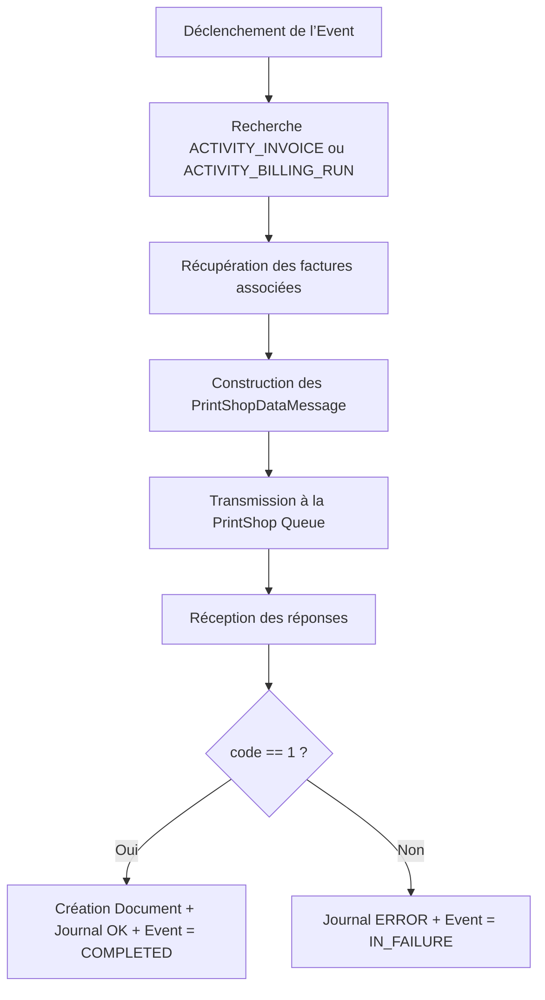


---


## ⚙️ Règles métier détaillées


### 🔹 1. Recherche des factures à imprimer


- Le tag cherche en priorité une relation `ACTIVITY_INVOICE`

- À défaut, une relation `ACTIVITY_BILLING_RUN`

- S’il n’y a aucune des deux → **Erreur bloquante**


📛 **Erreur levée** : `MISSING_INVOICE_AND_BILLINRUN`

> Aucun lien n’a permis d’identifier une ou plusieurs factures à imprimer


---


### 🔹 2. Envoi du message d’impression


- Pour chaque facture identifiée (`billId`), un `PrintShopDataDetailMessage` est créé

- Il est encapsulé dans un `PrintShopDataMessage`, avec :

- le `ObjectType = BILL`

- l’`eventId` associé

- Le message est envoyé via `printShopQueueProducer.publish(...)`


- Un journal est ajouté via :

```java

journalUtils.addJournal(ObjectType.BILL, billId, "PRINTSHOP_BILL", [...])

```


---


### 🔹 3. Réception et traitement de la réponse


Réponse reçue sous forme d’un `PrintShopDataDetailResponse` :


- Si `code == "1"` (succès) :

- Un `Document` est créé et stocké :

- avec le `objectId`, `objectType`, `path`, `description`

- Deux journaux de succès (`BILL_PRINTSHOP_INFO`) sont enregistrés

- Le statut de l’événement est mis à jour en `COMPLETED`


- Sinon (échec ou erreur) :

- Deux journaux d’erreur (`BILL_PRINTSHOP_ERROR`) sont ajoutés

- Le statut de l’événement est mis à jour en `IN_FAILURE`


---


## 🧾 Liste des erreurs métier


| Code | Description | Condition déclenchante |
|------|-------------|------------------------|
| `MISSING_INVOICE_AND_BILLINRUN` | Aucun lien `ACTIVITY_INVOICE` ni `ACTIVITY_BILLING_RUN` trouvé | Impossible d’identifier les factures à envoyer |


---


## 📝 Journalisation


- Pour chaque facture envoyée :

- `PRINTSHOP_BILL` avec `ObjectType.BILL`

- Pour chaque réponse reçue :

- En cas de succès : `BILL_PRINTSHOP_INFO` (deux journaux : facture + événement)

- En cas d’échec : `BILL_PRINTSHOP_ERROR` (idem)


Chaque message envoyé ou reçu est également tracé dans la liste des `messageCodes` du journal principal de l’événement.


---


## 📘 Glossaire


| Terme | Définition |
|-------|------------|
| `PrintShopQueueProducer` | Composant émettant les messages d’impression |
| `PrintShopDataMessage` | Message de niveau global (multi-factures) |
| `PrintShopDataDetailMessage` | Message lié à une facture spécifique |
| `PrintShopDataDetailResponse` | Réponse à une impression unitaire |
| `Document` | Objet métier représentant un document généré |
| `LauncherFatalException` | Exception critique bloquante |
| `ACTIVITY_INVOICE` | Lien entre activité et une facture spécifique |
| `ACTIVITY_BILLING_RUN` | Lien entre activité et une campagne de facturation |

---


## ✅ Résumé


Le tag `BillingPrintShop` permet à Billariz de **s’interfacer avec un système d’impression externalisé**,

pour générer les documents finaux de facturation (PDF, publipostage, etc.).

Il garantit que chaque facture est bien transmise, traquée, et qu’un document est enregistré à son retour.

Il constitue **la dernière étape technique avant archivage, impression ou envoi**.


---

# Facturation - Vérification de facturation au plus tard 

---

Tag `BillingBadCheck`


---


## 🧭 Contexte


Le tag `BillingBadCheck` est un **plugin d’exécution d’événement** déclenché automatiquement par le moteur Billariz pour gérer les cas de **contrats sans segments de facturation valides**.

Il permet de générer dynamiquement une **estimation de consommation** (type "meter read") lorsqu’aucune donnée réelle ne permet de valoriser les services rattachés à un contrat.


---


## 🎯 Objectif fonctionnel


- Vérifier si un événement de facturation dispose de segments de facturation valides

- Si ce n’est pas le cas :

- Générer une estimation de consommation sur la base de l’historique ou d’estimations configurées

- Réinjecter une nouvelle itération de l’événement

- Sinon :

- Marquer l’événement comme terminé


---


## 🔁 Cycle fonctionnel


1. L’événement de type `BillingBadCheck` est exécuté

2. Le tag identifie le contrat lié à l’activité

3. Il recherche les services facturables (`serviceElementList`)

4. Il vérifie l’existence de segments (`billSegments`) pour le `billingRun` courant

5. Si aucun segment :

- Une estimation `MeterRead` est générée avec un ou plusieurs `MeterReadDetail`

- L’événement est renvoyé en `PENDING` pour nouvelle itération

6. Sinon :

- L’événement passe à `COMPLETED`


---


## 🔧 Données manipulées


- `Contract`, `BillingRun`, `ServiceElement`

- `MeterRead`, `MeterReadDetail`

- `ParameterRepository` pour la récupération des statuts SE autorisés

- `Journal` pour la traçabilité de chaque décision

- `messageCode` pour la transmission des messages d’état


---


## 💬 Conditions d’entrée


- Un `Event` lié à une `Activity` de type facturation

- Aucun `BillSegment` existant pour les services actifs

- Estimation autorisée sur les `ServiceElement`


---


## 📌 Spécificités fonctionnelles


| Élément | Détail |
|--------|--------|
| Autorise plusieurs itérations ? | ✅ Oui – l’événement peut être replanifié automatiquement |
| Modifie le statut de l’activité ? | ✅ Oui – en cas d’erreur bloquante, passe en `BLOCKED` |
| Ajoute un journal ? | ✅ Oui – via `JournalUtils` |
| Mode d’exécution supporté | `AUTO`, `EVENT_MANAGER` |

---


## 🧪 Cas métier illustratif


> Un contrat actif ne dispose d’aucune donnée de consommation réelle pour la période de facturation.

> Grâce au tag `BillingBadCheck`, le système :

> - génère une estimation basée sur l’historique ou des paramètres fournisseur,

> - crée automatiquement une `MeterRead` et ses détails,

> - replanifie l’événement pour une nouvelle tentative.


---


## ⚠️ Erreurs métier possibles


| Code | Description |
|------|-------------|
| `MISSING_CONTRACT` | Contrat manquant dans la relation |
| `MISSING_BILLING_RUN` | Aucun billingRun lié |
| `MISSING_BILLABLE_SERVICES` | Aucun service éligible à facturation |
| `NO_ELEMENT_TO_BILL` | Pas d’élément éligible à estimation |
| `MISSING_ESTIMATE[_ELEGIBLE]` | Aucune estimation disponible pour calculer |

---


## 📘 Glossaire


| Terme | Définition |
|-------|------------|
| `MeterRead` | Estimation globale de consommation |
| `MeterReadDetail` | Détail horaire ou par service de la consommation |
| `BillSegment` | Segment de facturation concret dans le système |
| `SeStatus` | Statut d’un Service Element (actif, suspendu, etc.) |

---